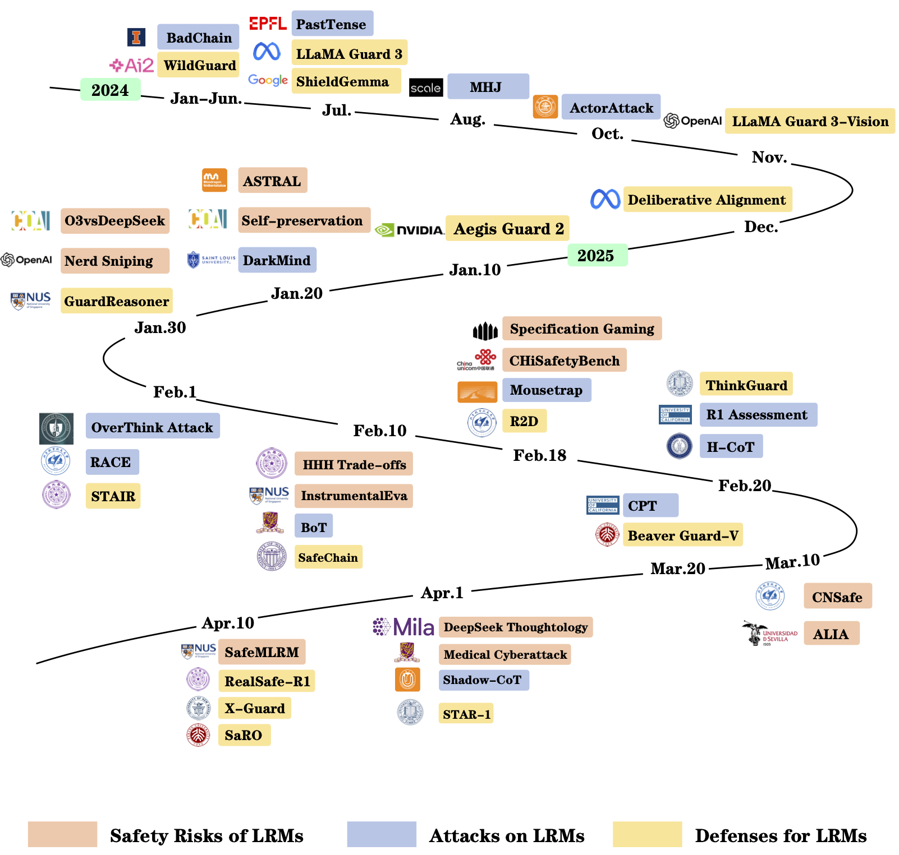
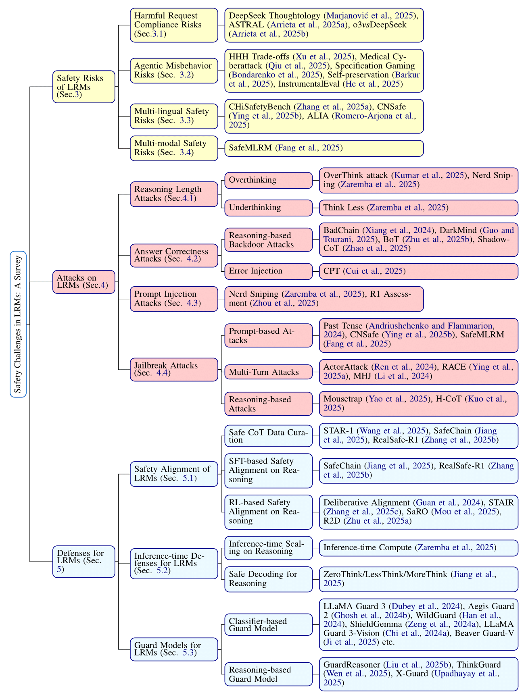

# [Awesome LRMs Safety](https://arxiv.org/abs/2504.17704) [](https://github.com/sindresorhus/awesome)


[](https://arxiv.org/abs/2504.17704)
<a href="">
  
</a>
<a href="">
  
</a>

---

This repository contains a carefully curated collection of papers discussed in our survey: ["Safety in Large Reasoning Models: A Survey"](https://arxiv.org/abs/2504.17704). As LRMs become increasingly powerful, understanding their safety implications becomes critical for responsible AI development. We created this resource to support researchers and practitioners working in this emerging field. If you find this repo useful for your work or research, it is really appreciated if you star this repository and cite our paper.

## 📚 What's Inside?
- 🔬 Cutting-edge research on LRMs vulnerabilities
- 🛠️ Novel attack methodologies against reasoning models
- 🛡️ Defense strategies and safety alignment techniques
- 🔄 Regular updates as the field evolves

## ✨ How to Contribute

- ⭐ Star this repository to show support
- 🔀 Create a PR if you notice missing papers
- 📣 Share with the research community

<div align="center">
  
  <br>
  
</div>


## Table of Content
<!-- START doctoc generated TOC please keep comment here to allow auto update -->
<!-- DON'T EDIT THIS SECTION, INSTEAD RE-RUN doctoc TO UPDATE -->
**Table of Contents**

- [Safety Risks of LRMs](#safety-risks-of-lrms)
  - [Harmful Request Compliance Risks](#harmful-request-compliance-risks)
  - [Agentic Misbehavior Risks](#agentic-misbehavior-risks)
  - [Multi-lingual Safety Risks](#multi-lingual-safety-risks)
  - [Multi-modal Safety Risks](#multi-modal-safety-risks)
- [Attacks on LRMs](#attacks-on-lrms)
  - [Reasoning Length Attacks](#reasoning-length-attacks)
  - [Answer Correctness Attacks](#answer-correctness-attacks)
  - [Prompt Injection Attacks](#prompt-injection-attacks)
  - [Jailbreak Attacks](#jailbreak-attacks)
- [Defenses for LRMs](#defenses-for-lrms)
  - [Safety Alignment of LRMs](#safety-alignment-of-lrms)
  - [Inference-time Defenses for LRMs](#inference-time-defenses-for-lrms)
  - [Guard Models for LRMs](#guard-models-for-lrms)
- [Contributors](#contributors)

<!-- END doctoc generated TOC please keep comment here to allow auto update -->

## Safety Risks of LRMs

### Harmful Request Compliance Risks

| Time | Title | Venue | Paper | Code |
| ---- | ----- | :--:  | :--: | :--:  |
|   25.04   |  DeepSeek-R1 Thoughtology: Let's <think> about LLM Reasoning | Arxiv |   [link](https://arxiv.org/pdf/2504.07128)  |    -  |
|   25.01   | Early External Safety Testing of OpenAI's o3-mini: Insights from the Pre-Deployment Evaluation | Arxiv |   [link](https://arxiv.org/pdf/2501.17749)   |   -   |
|   25.01   | o3-mini vs DeepSeek-R1: Which One is Safer? | Arxiv |  [link](https://arxiv.org/pdf/2501.18438)    |    -  |

### Agentic Misbehavior Risks

| Time | Title | Venue | Paper | Code |
| ---- | ----- | :--:  | :--:  | :--: |
|   25.04   | Emerging Cyber Attack Risks of Medical AI Agents | Arxiv | [link](https://arxiv.org/pdf/2504.03759) | - |
|   25.02   | Nuclear Deployed: Analyzing Catastrophic Risks in Decision-making of Autonomous LLM Agents | Arxiv | [link](https://arxiv.org/abs/2502.11355) | [link](https://github.com/pillowsofwind/LLM-CBRN-Risks) |
|   25.02   |  Demonstrating specification gaming in reasoning models | Arxiv | [link](https://arxiv.org/pdf/2502.13295) | - |
|   25.02  | Evaluating the Paperclip Maximizer: Are RL-Based Language Models More Likely to Pursue Instrumental Goals? | Arxiv | [link](https://arxiv.org/pdf/2502.12206) | [link](https://github.com/yf-he/InstrumentalEval) |
|    25.01  | Deception in LLMs: Self-Preservation and Autonomous Goals in Large Language Models | Arxiv | [link](https://arxiv.org/pdf/2501.16513) | - |


### Multi-lingual Safety Risks

| Time | Title | Venue | Paper | Code |
| ---- | ----- | :--:  | :--:  | :--: |
|   25.03   | Towards Understanding the Safety Boundaries of DeepSeek Models: Evaluation and Findings  | Arxiv | [link](https://arxiv.org/pdf/2503.15092) | [link](https://github.com/NY1024/DeepSeek-Safety-Eval) |
|   25.03   | Red Teaming Contemporary AI Models: Insights from Spanish and Basque Perspectives | Arxiv | [link](https://arxiv.org/pdf/2503.10192) | - |
|   25.02   | Safety Evaluation of DeepSeek Models in Chinese Contexts | Arxiv | [link](https://arxiv.org/pdf/2502.11137) | - |

### Multi-modal Safety Risks

| Time | Title | Venue | Paper | Code |
| ---- | ----- | :--:  | :--:  | :--: |
|   25.04   | SafeMLRM: Demystifying Safety in Multi-modal Large Reasoning Models | Arxiv | [link](https://arxiv.org/pdf/2504.08813) | [link](https://github.com/fangjf1/OpenSafeMLRM) |

## Attacks on LRMs

### Reasoning Length Attacks

| Time | Title | Venue | Paper | Code |
| ---- | ----- | :--:  | :--:  | :--: |
| ***<ins>Overthinking</ins>*** |  | | | |
|   25.02   | OverThink: Slowdown Attacks on Reasoning LLMs | Arxiv | [link](https://arxiv.org/pdf/2502.02542) | [link](https://github.com/akumar2709/OVERTHINK_public) |
|   25.01   | Trading Inference-Time Compute for Adversarial Robustness | Arxiv | [link](https://arxiv.org/pdf/2501.18841) | - |
| ***<ins>Underthinking</ins>*** |  | | | |
|   25.01   | Trading Inference-Time Compute for Adversarial Robustness | Arxiv | [link](https://arxiv.org/pdf/2501.18841) | - |

### Answer Correctness Attacks

| Time | Title | Venue | Paper | Code |
| ---- | ----- | :--:  | :--:  | :--: |
| ***<ins>Reasoning-based Backdoor Attacks</ins>*** |  | | | |
|   25.04   | ShadowCoT: Cognitive Hijacking for Stealthy Reasoning Backdoors in LLMs | Arxiv | [link](https://arxiv.org/pdf/2504.05605) | - |
|   25.02   | BoT: Breaking Long Thought Processes of o1-like Large Language Models through Backdoor Attack | Arxiv | [link](https://arxiv.org/pdf/2502.12202) | [link](https://github.com/zihao-ai/BoT) |
|   25.01   | DarkMind: Latent Chain-of-Thought Backdoor in Customized LLMs | Arxiv | [link](https://arxiv.org/pdf/2501.18617) | - |
|   24.01   | BadChain: Backdoor Chain-of-Thought Prompting for Large Language Models | Arxiv | [link](https://arxiv.org/pdf/2401.12242) | - |
| ***<ins>Error Injection</ins>*** |  | | | |
|   25.03   | Process or Result? Manipulated Ending Tokens Can Mislead Reasoning LLMs to Ignore the Correct Reasoning Steps | Arxiv | [link](https://arxiv.org/pdf/2503.19326) | - |

### Prompt Injection Attacks

| Time | Title | Venue | Paper | Code |
| ---- | ----- | :--:  | :--:  | :--: |
|   25.02   | The Hidden Risks of Large Reasoning Models: A Safety Assessment of R1 | Arxiv | [link](https://arxiv.org/pdf/2502.12659) | - |
|   25.01   | Trading Inference-Time Compute for Adversarial Robustness | Arxiv | [link](https://arxiv.org/pdf/2501.18841) | - |


### Jailbreak Attacks

| Time | Title | Venue | Paper | Code |
| ---- | ----- | :--:  | :--:  | :--: |
| ***<ins>Prompt-based Attacks</ins>*** |  | | | |
|   25.04   | SafeMLRM: Demystifying Safety in Multi-modal Large Reasoning Models | Arxiv | [link](https://arxiv.org/pdf/2504.08813) | [link](https://github.com/fangjf1/OpenSafeMLRM) |
|   25.03   | Towards Understanding the Safety Boundaries of DeepSeek Models: Evaluation and Findings  | Arxiv | [link](https://arxiv.org/pdf/2503.15092) | [link](https://github.com/NY1024/DeepSeek-Safety-Eval) |
|   24.07   |  Does Refusal Training in LLMs Generalize to the Past Tense? | Arxiv | [link](https://arxiv.org/pdf/2407.11969) | [link](https://github.com/tml-epfl/llm-past-tense) |
| ***<ins>Multi-Turn Attacks</ins>*** | | | | |
|   25.02   | Reasoning-Augmented Conversation for Multi-Turn Jailbreak Attacks on Large Language Models | Arxiv | [link](https://arxiv.org/pdf/2502.11054) | [link](https://github.com/NY1024/RACE) |
|   24.10   | Derail Yourself: Multi-turn LLM Jailbreak Attack through Self-discovered Clues | Arxiv | [link](https://arxiv.org/pdf/2410.10700) | [link](https://github.com/AI45Lab/ActorAttack) |
|   24.08   | LLM Defenses Are Not Robust to Multi-Turn Human Jailbreaks Yet | Arxiv | [link](https://arxiv.org/pdf/2408.15221) | [link](https://huggingface.co/datasets/ScaleAI/mhj) |
| ***<ins>Reasoning-based Attacks</ins>*** | | | | |
|   25.02   | A Mousetrap: Fooling Large Reasoning Models for Jailbreak with Chain of Iterative Chaos | Arxiv | [link](https://arxiv.org/pdf/2502.15806) | - |
|   25.02   | H-CoT: Hijacking the Chain-of-Thought Safety Reasoning Mechanism to Jailbreak Large Reasoning Models | Arxiv | [link](https://arxiv.org/pdf/2502.12893) | [link](https://github.com/dukeceicenter/jailbreak-reasoning-openai-o1o3-deepseek-r1) |

## Defenses for LRMs

### Safety Alignment of LRMs

| Time | Title | Venue | Paper | Code |
| ---- | ----- | :--:  | :--:  | :--: |
| ***<ins>Safe CoT Data Curation</ins>*** | | | | |
|   25.04   | STAR-1: Safer Alignment of Reasoning LLMs with 1K Data | Arxiv | [link](https://arxiv.org/pdf/2504.01903) | [link](https://github.com/UCSC-VLAA/STAR-1) |
|   25.04   | RealSafe-R1: Safety-Aligned DeepSeek-R1 without Compromising Reasoning Capability | Arxiv | [link](https://arxiv.org/pdf/2504.10081) | [link](https://huggingface.co/RealSafe) |
|   25.02   | SafeChain: Safety of Language Models with Long Chain-of-Thought Reasoning Capabilities | Arxiv | [link](https://arxiv.org/pdf/2502.12025) | [link](https://safe-chain.github.io/) |
| ***<ins>SFT-based Safety Alignment on Reasoning</ins>*** | | | | |
|   25.04   | RealSafe-R1: Safety-Aligned DeepSeek-R1 without Compromising Reasoning Capability | Arxiv | [link](https://arxiv.org/pdf/2504.10081) | [link](https://huggingface.co/RealSafe) |
|   25.02   | SafeChain: Safety of Language Models with Long Chain-of-Thought Reasoning Capabilities | Arxiv | [link](https://arxiv.org/pdf/2502.12025) | [link](https://safe-chain.github.io/) |
| ***<ins>RL-based Safety Alignment on Reasoning</ins>*** | | | | |
|   25.04   | SaRO: Enhancing LLM Safety through Reasoning-based Alignment | Arxiv | [link](https://arxiv.org/pdf/2504.09420) | [link](https://github.com/MurrayTom/SaRO) |
|   25.02   | STAIR: Improving Safety Alignment with Introspective Reasoning | Arxiv | [link](https://arxiv.org/pdf/2502.02384) | [link](https://github.com/thu-ml/STAIR) |
|   25.02   | Reasoning-to-Defend: Safety-Aware Reasoning Can Defend Large Language Models from Jailbreaking | Arxiv | [link](https://arxiv.org/pdf/2502.12970) | [link](https://github.com/chuhac/Reasoning-to-Defend) |
|   24.12   | Deliberative Alignment: Reasoning Enables Safer Language Models | Arxiv | [link](https://arxiv.org/pdf/2412.16339) | - |

### Inference-time Defenses for LRMs

| Time | Title | Venue | Paper | Code |
| ---- | ----- | :--:  | :--:  | :--: |
| ***<ins>Inference-time Scaling on Reasoning</ins>*** | | | | |
|   25.01   | Trading Inference-Time Compute for Adversarial Robustness | Arxiv | [link](https://arxiv.org/pdf/2501.18841) | - |
| ***<ins>Safe Decoding for Reasoning</ins>*** | | | | |
|   25.02   | SafeChain: Safety of Language Models with Long Chain-of-Thought Reasoning Capabilities | Arxiv | [link](https://arxiv.org/pdf/2502.12025) | [link](https://safe-chain.github.io/) |

### Guard Models for LRMs

| Time | Title | Venue | Paper | Code |
| ---- | ----- | :--:  | :--:  | :--: |
| ***<ins>Classifier-based Guard Model</ins>*** | | | | |
|   25.03   | Safe RLHF-V: Safe Reinforcement Learning from Human Feedback in Multimodal Large Language Models | Arxiv | [link](https://arxiv.org/pdf/2503.17682) | [link](https://github.com/SafeRLHF-V) |
|   25.01   | Aegis2.0: A Diverse AI Safety Dataset and Risks Taxonomy for Alignment of LLM Guardrails | Arxiv | [link](https://arxiv.org/pdf/2501.09004) | - |
|   24.11   | Llama Guard 3 Vision: Safeguarding Human-AI Image Understanding Conversations | Arxiv | [link](https://arxiv.org/pdf/2411.10414) | - |
|   24.07   | ShieldGemma: Generative AI Content Moderation Based on Gemma | Arxiv | [link](https://arxiv.org/pdf/2407.21772) | [link](https://huggingface.co/google/shieldgemma-2b) |
|   24.07   |  (LLaMA Guard) The Llama 3 Herd of Models | Arxiv | [link](https://arxiv.org/pdf/2407.21783) | - |
|   24.06   | WildGuard: Open One-Stop Moderation Tools for Safety Risks, Jailbreaks, and Refusals of LLMs | Arxiv | [link](https://arxiv.org/pdf/2406.18495) | [link](https://github.com/allenai/wildguard) |
| ***<ins>Reasoning-based Guard Model</ins>*** | | | | |
|   25.04   |  X-Guard: Multilingual Guard Agent for Content Moderation | Arxiv | [link](https://arxiv.org/pdf/2504.08848) | - |
|   25.02   | ThinkGuard: Deliberative Slow Thinking Leads to Cautious Guardrails | Arxiv | [link](https://arxiv.org/pdf/2502.13458) | [link](https://github.com/luka-group/ThinkGuard) |
|   25.01   | GuardReasoner: Towards Reasoning-based LLM Safeguards | Arxiv | [link](https://arxiv.org/pdf/2501.18492) | [link](https://github.com/yueliu1999/GuardReasoner/) |

## Reference

If you find our repo or paper helpful, it is really appreciated if you cite our papers. :sparkles:

```
@article{wang2025safety,
  title={Safety in Large Reasoning Models: A Survey}, 
  author={Cheng Wang and Yue Liu and Baolong Li and Duzhen Zhang and Zhongzhi Li and Junfeng Fang},
  journal={arXiv preprint arXiv:2504.17704},
  year={2025}
}
```

## Contributors
<a href="https://github.com/WangCheng0116" target="_blank"></a> 
<a href="https://github.com/yueliu1999" target="_blank"></a> 
<a href="https://github.com/fangjf1" target="_blank"></a> 


